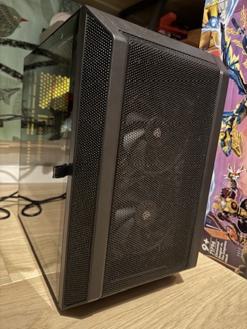
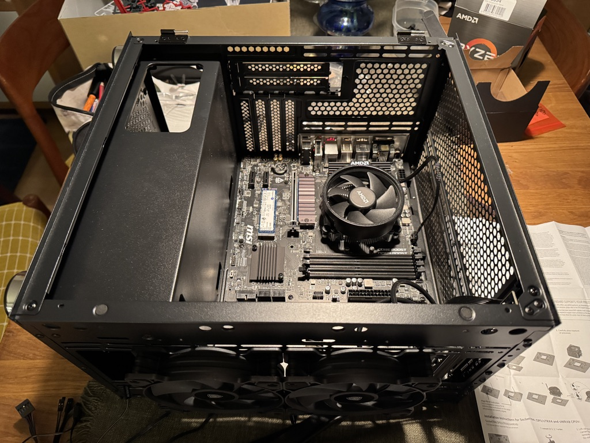

I used to build my own PCs until I moved to Mac in 2006. Recently I had to try my hand at it again because of a request by a family member.

My "customer" wanted a PC that would run Roblox better than the 2014 iMac he was using and which kept resetting due to an overheated GPU, even at the lowest graphics quality setting. To make things harder he gave me a budget of 500 Euros, and although I appreciated the restrain this put some serious limitations on the choice of components.

The end result met the requirements and was fun to build. It costed 540 Euros, only slightly over budget, and can run Roblox at medium quality without a hitch. I could have spent 120 EUR more for a much better graphics card, but I had to work within my budget.

Some things about the building process are exactly the same as 20 years ago, others have changed:

- The majority of the components are connected in the same way as they used to be
- SSDs have replaced hard drives (it's been a while now)
- Youtube has a lot of tutorials and you will likely find a walkthrough of your exact build or close to it
- On the other hand paper manuals have gotten much worse and are basically useless
- The site [PCPartpicker](https://pcpartpicker.com) is a godsend to check component compatibility and prices, as well as seeing what other people have built

## Picking the parts

Since I didn't know where to start, I googled "budget gaming PC" and landed on this article:

[https://www.tomshardware.com/best-picks/best-pc-builds-gaming](https://www.tomshardware.com/best-picks/best-pc-builds-gaming)

The [final build](https://pcpartpicker.com/b/PCsXsY) ended up being pretty close, but I went for a full AMD (CPU + GPU) setup. The article recommends the Intel Arc A380 GPU, and I would have really liked to give it a chance since [I have worked on it](/work/intel-gfx/), but fearing driver incompatibilities I decided against it. It was also considerably more expensive than the RX 6400 I went with.

Although I've alwasy been an Intel user, this time I wanted to try an AMD CPU, attracted by its reputation of having better price/performance ratio and lower power consumption.

At this point I realized that in 2025 you don't start a new project with a Google search, but with a chat with an AI, so I asked [Claude](https://claude.ai/) for a recommendation. Here is its first answer after I clarified the requirements (I initially gave it a budget of 800 EUR):

`Here's a suggested build that should work well:`

`CPU: AMD Ryzen 5 5600 (around 130-150 EUR)`

- `Great value for gaming`
- `Includes a decent stock cooler`
- `6 cores/12 threads is plenty for these games`

`GPU: AMD RX 6600 (around 250-280 EUR)`

- `More than enough for Roblox and Fortnite`
- `Can handle 1080p gaming at high settings`
- `Good power efficiency`

`Motherboard: B550M motherboard (around 90-110 EUR)`

- `MSI B550M PRO-VDH or similar`
- `Has all the features you need`
- `Good upgrade path`

`RAM: 16GB (2x8GB) DDR4-3200 (around 50-60 EUR)`

- `Two sticks for dual-channel performance`
- `16GB is plenty for these games`

`Storage:`

- `500GB NVMe SSD (around 45-55 EUR)`
- `Optional: 1TB HDD (around 45 EUR) if more storage needed`

`Case: Budget ATX case with good airflow (around 50-60 EUR)`

- `Look for ones with mesh front panel`
- `Should include at least 2 fans`

`Power Supply: 550W 80+ Bronze (around 60-70 EUR)`

- `More than enough for this build`
- `Leave room for potential upgrades`

We then went back and forth about CPU and GPU (Claude confirmed that AMD is the better budget choice) and once everything was decided I got a list of parts available in Finland and an estimate of the total price of 823 EUR. At this point I realized that there had to be a website for PC builders to make the whole process easier so I asked and Claude answered:

`Yes! The most popular one is PCPartPicker (`[`pcpartpicker.com`](http://pcpartpicker.com)`). It's an excellent tool that:`

1. `Checks component compatibility automatically`
2. `Shows the best prices from different retailers`
3. `Calculates power consumption`
4. `Warns about potential issues (like if a CPU cooler might block RAM slots)`
5. `Has a direct Finnish version (`[`fi.pcpartpicker.com`](http://fi.pcpartpicker.com)`)`

It even created a [part list](https://fi.pcpartpicker.com/user/baleboy/saved/9f7ZFT) for my PC on PC Partpicker which I found amazing.

Using PC part picker I identified the Finnish on-line shops that sold the components and bought the cheapest ones. To stay within the 500 Euros budget I selected the Radeon RX 6400, which in retrospect was a mistake, but more on this later.

Here are the shops I used:

- [Jimm's](https://www.jimms.fi) for the case
- [Verkkokauppa](https://www.verkkokauppa.com/fi/etusivu) for the CPU
- [Datatronic](https://datatronic.fi) for motherboard, memory, SSD and PSU
- [KTVerkkokauppa](https://ktverkkokauppa.fi) for the GPU which was on discount

## The build

I was a bit uncertain about the build process, of which I remembered very little from my past experiences. I started with the motherboard's instructions, but frankly they were not generous with details. Luckily I found this [video walkthrough of a similar build on Youtube](https://www.youtube.com/watch?v=BxFKqG1KOlo), which gave me confidence. Among other things, it showed that there is a SSD slot with heatsink that I hadn't realized was there and that the instructions made no mentions of.

After a first smoke test I attached the screen and the BIOS menu appeared!

As I was putting the memory banks next to each other I had a nagging feeling that this wasn't right, and the BIOS confirmed it with a message saying that I should place them in alternate slots. Funny how memory (my memory, not the RAM) works.

It was now time to install Windows. No more need for pirated CDs (ahem), today the process is to [download the ISO image from Microsoft](https://www.microsoft.com/en-us/software-download/windows11) and flash it to a USB memory stick. Here I found another hiccup because I was flashing the USB from Mac. I used the command line as instructed in [this forum post](https://discussions.apple.com/thread/255485219?answerId=260193685022#260193685022), but when the Windows installer launched on the PC it wouldn't find any driver files. After some more googling, it turns out that this happens when flashing the USB from Mac as I did (I can't find the link anymore), so I booted the iMac into Windows and repeated the flashing procedure. After that I was able to continue.

Except that now the installation process stopped because there was no network, due to the fact that the drivers for the motherboard's on-board Wifi chip weren't included in the Windows disk. I had to download them from MSI's website, copy them to another USB stick and install them from the command line. After this the installation finally completed, and all the hardware was properly configured.

## Benchmarks

The first benchmark I ever ran was 3DMark 2001. I watched its lobby scene, ripped straight off the Matrix, countless times, not just to measure performance but just to look at it because it was cool as hell.

[3DMark 2001 Demo 1080p](https://www.youtube.com/watch?v=yg7Vk4b0Ook#embed)

The fact that it was made in Finland by the same guys who created the Second Reality demo and the game Max Payne added to the mystique. For as long as I have built PCs, [3D Mark](https://www.3dmark.com) has always been my go-to benchmark.

Much later, in 2020, I went to work for [Basemark](https://www.basemark.com), a spin-off of a spin-off from Futuremark (maker of 3DMark and later acquired by UL Benchmarks), and this connection was part of the appeal that brought me there. Basemark, as the name implies, makes [benchmarks](https://www.gpuscore.com) as well, and their unique selling point is to be cross-platform across PC, Mac, mobile and multiple graphics APIs. It was exactly what I needed to compare the iMac with the new PC, something that I couldn't do with 3D Mark.

And after this long detour down memory lane (again, not RAM), here are the results:

|                         | iMac 2014 | PC           |
| ----------------------- | --------- | ------------ |
| Basemark GPU 1.2 High   | 1304      | 3502 (+168%) |
| Basemark GPU 1.2 Medium | 28713     | 43329 (+50%) |
| GPUScore Sacred Path    | 2655      | 4254 (+60%)  |

All in all not bad, the performance was more than double on the High workload and significantly higher on the rest.

I thought that with this performance Roblox would run at highest quality with no problem, but actually this turned out not to be the case and we had to reduce the quality to medium for better FPS. The RX 6400 is cheap for a reason, it is meant for small factor PCs with passive cooling but isn't really very powerful. This is obvious when comparing it with the RX 6600 which is about 100 EUR more expensive but has double the performance, and would have been a much better choice (Claude is probably saying "I told you so" right now).

Speaking of buyer's remorse, how did this build compare with Tom's Hardware's recommended budget gaming setup? Answering this question required looking for benchmark results on-line, and this time I had to turn to 3D Mark because Powerboard, Basemark's results site, has way less data and a horrible search interface.

3D Mark has a lot of workloads, but the ones that seemed relevant to me were the 1080p DX12 benchmarks meant for lower end gaming PCs. Since I had no result to compare with for Tom's Hardware's PC, I browsed the database and found a similar build. I also added the results for a PC similar to mine but with RX 6600. The overall power usage is taken from PCPartPicker by replacing CPU and GPU in my part list. Similarly for the overall price.

Here are the results:

| **3D Mark workload** | My PC                                       | Tom's PC (approx)                           |
| -------------------- | ------------------------------------------- | ------------------------------------------- |
| Timespy (overall)    | [3830](https://www.3dmark.com/spy/53153290) | [4232](https://www.3dmark.com/spy/50939869) |
| Timespy (CPU)        | 7483                                        | 6827                                        |
| Timespy (Graphics)   | 3569                                        | 3967                                        |
| Steel Nomad          | [470](https://www.3dmark.com/sn/3645880)    | [767](https://www.3dmark.com/sn/2024949)    |
| Estimated wattage    | 202W                                        | 269W                                        |
| Price                | 545 €                                       | 604 €                                       |

So, an extra 60 EUR would have given me slightly better graphics perfomance, slightly worse CPU performance and higher power draw. The better CPU score is because of the higher number of cores in the Ryzen, but the single-threaded performance is actually slightly better on the Core i3 according to other benchmarks I found on line.

The result on Steel Nomad, which is a heavier benchmark than Time Spy, surprised me a bit but I think the Intel Arc 380A wins because of its 6GB DDR6 memory as opposed to 4GB in the Radeon. 3D Mark did warn me that I could run out of memory while running the workload.

One thing that bothered me was that the first benchmark results I got were marked as "Graphics Driver is not approved". This is because the driver I was using was not WHQL certified (WHQL is a Windows quality certification), although I had installed them from MSI. After installing the latest drivers from AMD I got the green checkmark in 3DMark, which means that my results are now included in the official charts (not sure that's a good thing given how low they are). However the score on Steel Nomad dropped to 72, but I write that off as a one-time fluke.

I also compared my build with a similar one with RX 6600 and RX 7600:

| **3D Mark workload** | My PC | Ryzen 5 5500 + RX 6600 (avg) | Ryzen 5 5500 + RX 7600 (avg) |
| -------------------- | ----- | ---------------------------- | ---------------------------- |
| Timespy (overall)    | 3830  | 7921                         | 10086                        |
| Timespy (CPU)        | 7483  | 7617                         | 7412                         |
| Timespy (Graphics)   | 3569  | 7992                         | 10808                        |
| Steel Nomad          | 470   | 1492                         | 2296                         |
| Estimated wattage    | 202W  | 281 W                        | 339 W                        |
| Price                | 545 € | 666 €                        | 810 €                        |

For an extra 100 EUR I could have gotten the Radeon RX 6600 with twice the performance, which clearly would have been worth it. The 7600 starts to be a bit too expensive for the gain.

In conclusion I think I met the requirements well enough and was able to buy a decent PC on the cheap. The Radeon RX 6400 will have to go at the first occasion, but for now I haven't heard any complaints.

