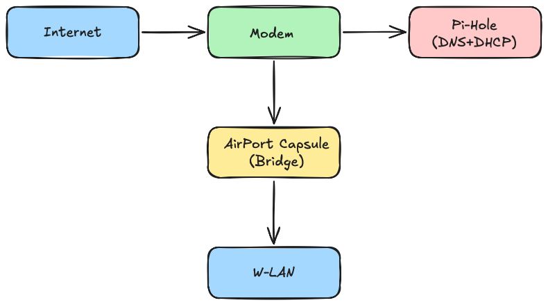
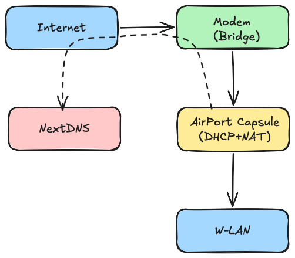
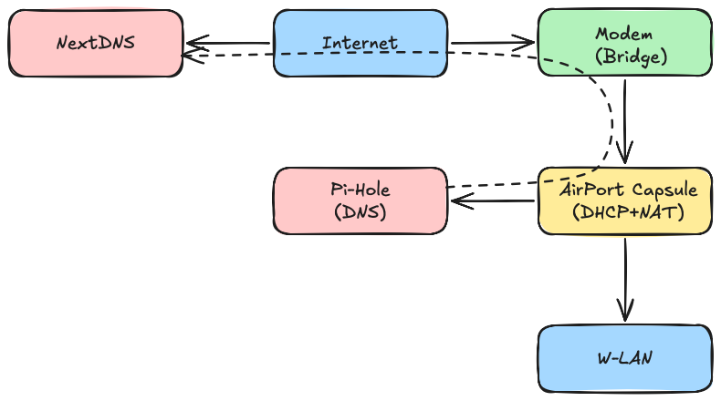
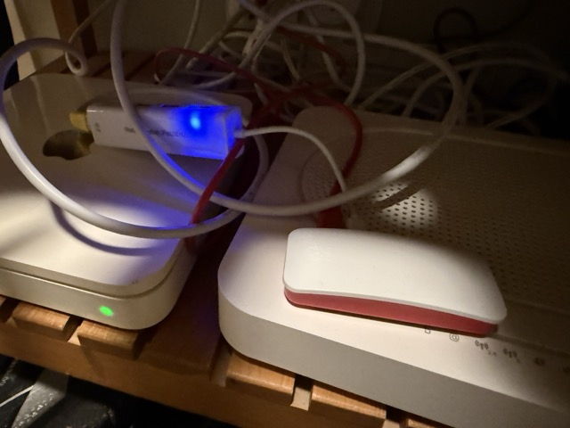

With a teenager in the house, I thought it might be a good idea to protect my home network from unwanted content, or at least know what sites are being accessed. The most common way to do it seems to be through a DNS filter, and I thought it would be a fun experiment to set up something local as opposed to rely on an external, possibly paid service.

A little bit of research brought me to the [Pi-hole project](https://pi-hole.net), which turns a Raspberry Pi into a DNS filter (and more), and to the [Raspberry Pi Zero 2 W](https://www.raspberrypi.com/products/raspberry-pi-zero-2-w/), a low-power version of the Raspberry Pi that is still more than enough to run this service and can stay on for 24 hours a day without drawing too much power.

## Pi-hole DNS filtering over Wi-Fi

After acquiring a Pi Zero, the first step was to install [Raspberry OS Lite](https://www.raspberrypi.com/software/operating-systems/) on an SD card and plug it in the board. The installer asks for the Wi-Fi SSID and password and enables ssh, so the board is ready to be logged in over wireless at first boot. 

After that, installing Pi-hole was a breeze with the command line below:

```
curl -sSL https://install.pi-hole.net | bash
```

After this the Pi was ready to act as DNS for the local network and apply its filters. I also configured the ISP's DNS as a fallback, in case there was some weird address that Pi-hole couldn't resolve, for example for the IPTV (I have no technical basis to say this but it's just something my gut told me)

Disclamier: from this point on I'm going to use the words "modem" and "router" interchangeably to refer to the ADSL modem/router that connects my home network to the Internet.

Although the router has wireless capabilities, the actual WiFi hotspot in my network is an Airport Capsule connected to the router via ethernet and configured in bridge mode, so all the network configuration is handled by the router. I honestly don't remember why I set it up like this, probably I didn't want to configure the Airport to point to the ISP's DNS etc., but according to the old adage that if it ain't broken you don't fix it I was determined to change as little as possible.

With the Pi connected to the router via WiFi, the network looked like this:



The next step would have been to point the router's DNS address to the Pi's IP (which was statically assigned by the router's DHCP server), but unfortunately I discovered that my router didn't offer the option to change DNS server. 

To bypass the router's limitations, I decided to let Pi-hole act as a DHCP server in addition to DNS. This way devices on the network would get the DNS address from Pi-hole, which would set it to its own. Again this was easily configured in the Pi-hole admin panel, and I also had to disable the DHCP server in the router, which this time was possible.

The first time I configured the network this way everything stopped working after a while, likely because the Raspberry Pi was trying to get an address via DHCP which was disabled. I later retried after assigning a static IP to the Pi and after that things started working properly. I could now see the DNS queries in the Pi's dashboard.

For the records, configuring the network interfaces is done via the `nmtui` command line utility.

## Choosing a block list

Deciding what sites to block requires a "blocklist", i.e. a curated list of undesirable domain names. There are several of these lists available, one common source is https://github.com/StevenBlack/hosts. The site offers several blocklists for different purposes, I picked the ["unified hosts + porn extensions"](https://github.com/StevenBlack/hosts/blob/master/alternates/porn/readme.md) which blocks ads, malware, tracking and adult content and has a list of 157,475 hosts. 

To be honest I don't care too much about blocking ads, and in fact I feel bad for sites that rely on ads to make a living, but blocking ads seems to be the primary use case for DNS filters and blocklits. Note that the Pi-hole's domains database needs to be updated (doable from the admin panel or command line with `sudo pihole -g`) for the list to take effect.

I tested all the devices in the house and things seemed to work as expected, except for the Amazon Prime Video on our Smart TV. Looking at the logs and with some trial and error, I found that whitelisting the following domains (apparently identified as trackers) solved the problem:

```
aiv-delivery.net
api.eu-west-1.aiv-delivery.net
amazonvideo.com
media-amazon.com
```

## Pi-hole over Ethernet

At this point the setup was working quite well, but I had the nagging feeling that serving DHCP and DNS requests over a wireless connection wasn't the best in terms of reliability, so I decided to connect the Pi Zero via Ethernet. The board doesn't have an ethernet port, but it was easy to add a simple [USB-to-Ethernet adapter](https://thepihut.com/products/ethernet-hub-and-usb-hub-w-micro-usb-otg-connector?srsltid=AfmBOorohLbMiUnFEVyb7e-2YZNKKbK70l3rBBJCkZyAd7q5LNpfZb9n), and while I was at it I ordered an [enclosure](https://thepihut.com/products/official-raspberry-pi-zero-case) as well.

There was a moment of confusion when I plugged the ethernet adapter to the wrong port (the Zero has two USB ports, one for power only and one for power and data), but aside from that the wired interface showed up in the list of devices and I could assign it an IP address.

Again I used `nmtui` to configure the IP address of the ethernet interface.

Now I could point everything to the Pi's static address disable Wi-Fi.

## Switching to NextDNS

While I was doing my experiments with Pi-hole, I heard about [NextDNS](https://nextdns.io) from someone at work. NextDNS is a cloud-based DNS filter that works like Pi-hole but with some extra features that I'll describe in a moment. To my suprise it's free which invalidated my initial objection to these types of services. The primary way to use NextDNS is via an installation on each device you want to protect, but there is an option to filter traffic from a home network as well.

Setting it up is straightforward: create an account on [my.nextdns.io](https://my.nextdns.io), configure the filtering options and point your DNS to the addresses found on the NextDNS page. Except of course that as I found out earlier, my router doesn't have the option to configure the DNS address. However by now I had realized that I could reverse my setup: make the router the bridge and the Airport the DNS and DHCP server. This required a little bit of fiddling.

My router has the option to turn the ETH4 interface into a pass-through, i.e. bridge, which is exactly what I needed. 

Here are the steps I took to change the network configuration:

1. **AirPort Utility → Network tab → Router Mode:** changed from *Off (Bridge Mode)* to *DHCP and NAT*.
2. **Internet tab:** set DNS servers to NextDNS IPs
3. Adjusted the LAN subnet to `10.0.1.x` to avoid conflicts with the modem’s `192.168.1.x` network.

After this, my topology looked like this:



When I visited [my.nextdns.io](https://my.nextdns.io), it recognized my public IP, but initially **no logs appeared**. The fix was to **link my IP address** under *Setup → Linked IPs* in NextDNS.
Seconds later, requests started showing up in the logs, showing the externally visible IP address of the modem.

## NextDNS vs Pi-Hole

Appearing as a single IP address was a downgrade from the Pi-hole because I couldn't tell which client was requesting which host. On the other hand, NextDNS had some additional features I liked, such as enforcing SafeSearch in Google's search result and restricting YouTube content, which Pi-hole doesn't support.

But the biggest drawback of NextDNS and what I would call a deal breaker is that wen I started a private browsing session and entered a "forbidden" URL (as a test!), to my surprise it opened without problems! It turns out that Safari Private Browsing sends its DNS requests directly to Apple’s privacy relays (Cloudflare / Akamai), bypassing any third-party DNS servers like NextDNS. This however doesn't happen with Pi-hole, because it sits inside the local private network and cannot be bypassed.

Frankly this last issue made NextDNS useless for me, and I was ready to give up its other feature when I realized that I could have the best of both worlds.

## Pi-Hole with NextDNS as third party DNS

Since I could now configure the DNS address in the Airport, I could point it to the Pi-Hole and use NextDNS as the third party DNS server to fall back to. This would allow me to see the clients' activity in the Pi-Hole dashboard, block private browsing, and also block Google and Youtube search results using Next DNS. Moving to this setup required the following steps:

1. Remove the static IP addresses from the Pi-hole, which were still in the 192.168.1.* subnetwork. This required connecting straight to the modem and accessing the Pi via that connection
2. Connect the Pi Zero to the AirPort via wired connection and configure a static IP in the 10.1.0.* subnetwork
3. Disable DHCP in Pi-Hole and configure NextDNS's addresses as the third party DNS
4. Point the Airport's DNS address to the static IP address of the Pi Zero

Side note: for reasons I can't explain, the Airport Utility doesn't show the clients connected via Ethernet and their IP address. This is baffling and made me realize that it's not meant for serious use.

But aside from some switching of cables, the setup worked on the first try and I could see all the traffic monitored and blocked successfully!

Here is the final network configuration:



And here is the setup in action:



## Conclusion

This was an interesting exercise, I learned a lot about different tools and ended up with a network configuration that while a little complex to manage, gives me a lot of control.