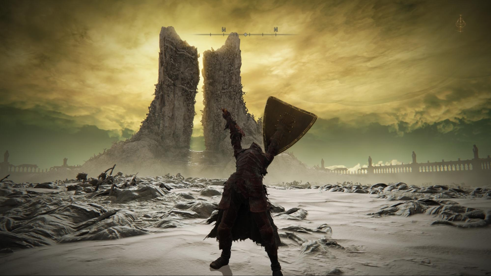
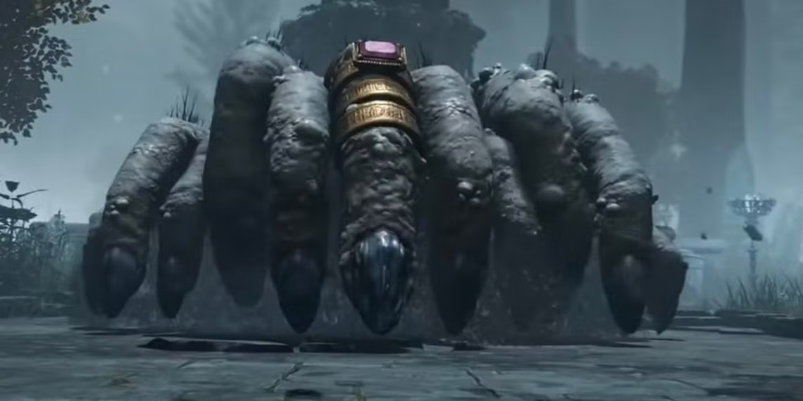
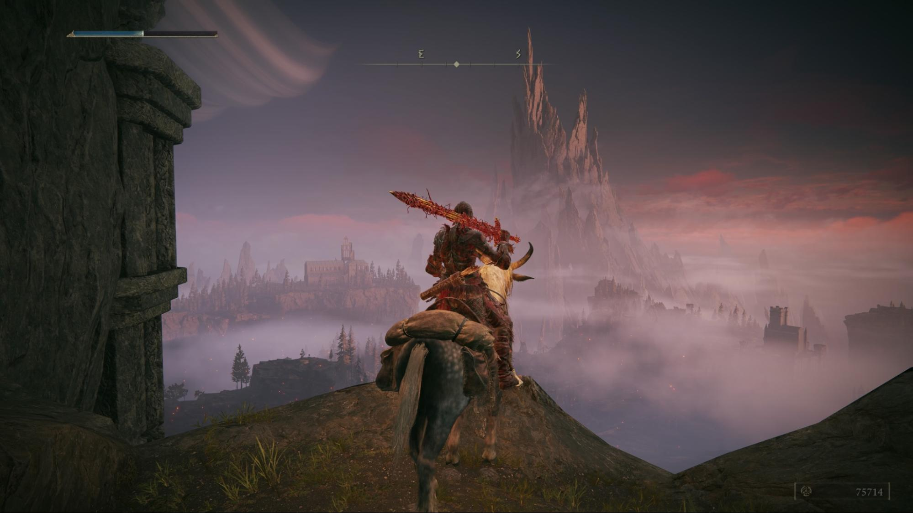
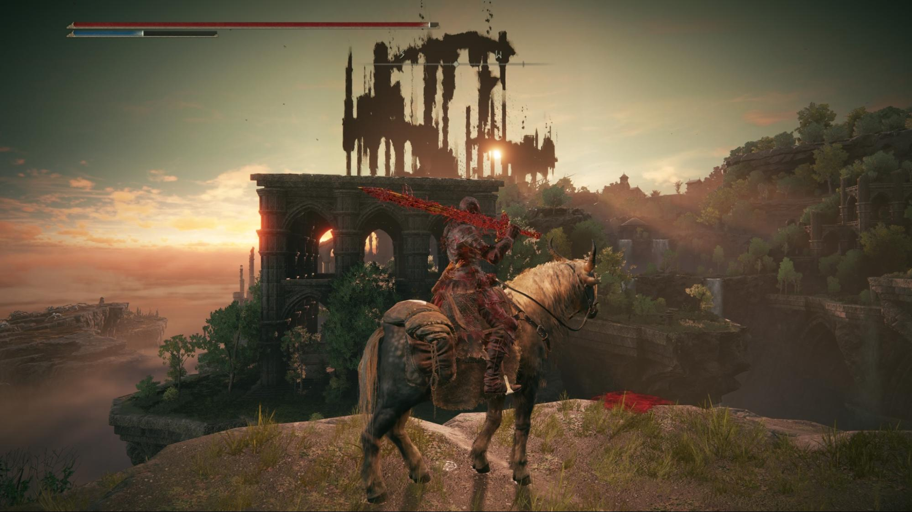

After two months and 236 hours, I finally finished Elden Ring! I thought it was a good opportunity to look back at my history with From Software’s Dark Souls franchise.

If you didn’t know it, Dark Souls, and its derivatives like Bloodborne and Elden Ring, are a series of games known for their legendary but ultimately fair difficulty. The structure is more or less always the same: you progress through a series of medieval-fantasy environments, kill enemies of increasing difficulty, collect “souls” to level up and face awe-inspiring bosses. Dying is part of the process - you should expect to die repeatedly until you learn the enemies’ pattern and beat them. Unlike other games, you won’t get far by mashing buttons semi-randomly. Every fight, even against lesser enemies, is a dance of dodges and parries until you find an opening. Timing is everything and mistakes are always punished, sometimes severely. For this reason people say that Dark Souls games have more in common with rhythm games than your average “brawler”.

It’s not just the difficulty that makes the games special though. The plot is obscure at best, and explained by short cutscenes, brief talks with weird NPCs and item descriptions. The monster design is incredibly imaginative, with some of the enemies looking like they came out of  a painting by Jeronimus Bosch (see the creepy “hand spider” below, aptly called “finger creeper”) . The levels are mazes that are revealed progressively, most of them looking beautiful. The music, especially during boss fights, is fantastic. The overall weirdness and design create a dream-like, or rather nightmare-like atmosphere.

Having been honed for decades, the physics and controls are outstanding. It feels like you are moving a solid, heavy character around rather than an ethereal bunch of pixels. The hitboxes are very precise and contribute to the physicality of the characters and objects.

Finally there is the multiplayer aspect. Players can be summoned to help against bosses, or invaded to be challenged in PVP action. It is possible to leave messages around the world to give hints to other players, but there is a catch: you can only select among a number of pre-written sentences, which contributes to the overall weirdness and leads to very specific humor such as the juvenile “try finger but hole”. The community is helpful but tough, with “git gud” being the classic answer to anybody looking for quick workarounds. Even Elon Musk plays Elden Ring and was [famously ridiculed for his character’s build](https://www.vice.com/en/article/elon-musks-elden-ring-build-is-terrible/).

The first From Software game I played was Bloodborne, about ten years ago. I had never heard about Dark Souls before and had no idea what I was getting myself into, but the reviews were unanimously enthusiastic and getting the game seemed like a no brainer. After dying endlessly against the first monster, I decided that the game was not for me and quit. I don’t remember why, but some time later, maybe a year, I decided that this couldn’t be and that I had to be able to play a game that so many people loved. I persisted, finished it and it became one of my favorite games of all time. I then went on to Dark Souls 2 and 3, the remaster of the Original Dark Soul, and now Elden Ring.

I don’t play that well, so I take every advantage the games throw at me. For one thing I always over-level, which doesn’t guarantee success but gives more room for errors since you can withstand more hits and inflict more damage. This means “farming” for the in-game currency (souls, blood echoes or runes) by doing repeated runs of areas with lesser enemies, but it’s a credit to the game that even doing this is fun and not something you can do without paying attention, because you can easily get killed if you attract too many enemies at once (it’s certainly not like [killing boars for 1 XP](https://www.youtube.com/watch?v=7SiSceGHJsQ)). I summon NPCs when possible, and in a couple of cases I requested the help of other players. And I have often consulted the numerous wikis and forums to learn boss strategies and solve the hardest riddles, because the game quite frankly gives you very little to work with.

Even so, getting to the end of each game is exhausting and incredibly rewarding. I still closely remember the adrenalin rush when I finally defeated [Martyr Logarius](https://bloodborne.wiki.fextralife.com/Martyr+Logarius) in Bloodborne after trying for several days, or the sincere hatred I felt for [Ebrietas, Daughter of the Cosmos](https://bloodborne.wiki.fextralife.com/Ebrietas,+Daughter+of+the+Cosmos), the boss it took me the longest to beat. My only regret is that I never managed to kill the [Nameless King](https://darksouls3.wiki.fextralife.com/Nameless+King) in Dark Souls 3. I guess I’m just not “gud” enough.

So what am I going to do with my time now that I’ve finished Elden Ring? It is common to play the game again in “New Game Plus” (NG+) mode, which lets you keep all the levels and items you have acquired during the course of the previous run. Right now the idea of playing through the game again feels daunting though. Or I could try the co-op multiplayer “Elden Ring - Nightreign” that was just released, but I’m more of a solo player. And then there is Sekiro, the only game in the series I haven’t finished yet. Or I could, you know, have a life again.
