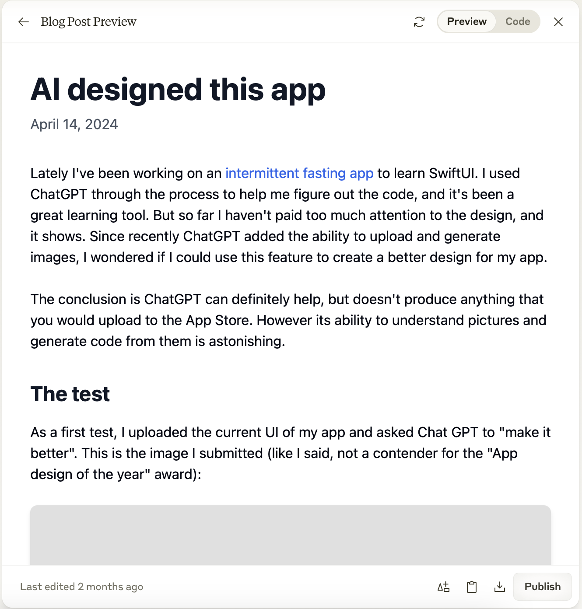

In my never-ending quest to get back to software development, I decided to write my own static site generator for this website. As programming language I picked Swift because I'm learning it at the moment and I needed an excuse to practice, although Python would have probably been the better choice.

The spec was straightforward: take the source markdown files used by the current generator ([Zola](https://www.getzola.org)) and convert them into a site that looks like the existing one. All in all it took me a few days (spread over two months due to the interference of adult life) and two iterations to get to the final result, which has generated the page you are reading at the moment and the rest of the site.

The resulting code is [available in Github](https://github.com/baleboy/balenet-gen). The generator itself is very simple and hardcoded to the structure of my site, and nobody but me will ever want to use it. But the process of how I got there might be interesting (spoiler: I used AI).

## Why?

There are many static site generators out there, and they all work more or less in the same way: you write the content as markdown files and the folder structure of the content defines the structure of the site. The look and feel is customized via HTML templates that are kept separate from the content. The generator takes the content and templates and mangles them together to produce the final site. The template system includes ways to express the programmatic creation of content, for example to generate an index of posts.

If there are so many static site generators, why create my own? First of all because it's fun, but also because sooner or later you will want to do something that doesn't come naturally to the generator and you will have to do all sorts of hacks to make it do what you want. For example I had to jump through many hoops to show embedded youtube videos the way I wanted using Zola.

Let me now introduce you to my two assistants on this project.

## Assistant #1: Claude

I used [Claude](https://claude.ai/) as my main sparring partner. I switched from ChatGPT to Claude because I read that it's better for code generation, and I can confirm that it's true, or at least it feels like it's true though I didn't make any direct comparison. I especially liked Claude's "projects" feature and the way it presents the code it generates in a separate pane, so that you don't have to constantly backscroll through your conversation (this last one became available for ChatGPT as well after I started with Claude).

## Assistant #2: Apple Intelligence

I also used XCode's AI coding assistant, powered by Apple Intelligence. This was disappointing and didn't feel as magical as Github Copilot. In more than one occasion XCode suggested code that wouldn't compile, or that did something else than what I needed. Also, the UX for confirming the code suggestions was messy at times and required me to try again repeatedly. I would like to try [Cursor](https://www.cursor.com) next time, although it requires some acrobatics to work with Apple's tools. I wonder why nobody has created an Apple-specific AI coding editor and called it XClaude.

## The process

Before I started retracing my steps to write this post, I thought that my experience with AI-assisted coding was similar to what many others have reported: I got to a first working prototype very quickly, but as I continued developing I realized that there was a better, simpler solution which I coded on my own. In reality what happened was that the first version presented by Claude was the best one, which I messed up by trying to be too clever, only to return to the original simpler version while forgetting that it was what Claude had suggested in the first place. I hope that this is at least partly due to the fact that I developed the whole thing in a couple of bursts a few weeks apart, with Christmas and New Year in between, and the celebrations erased my memory of what I had done.

To get to the first version, I gave one of my posts in MD format to Claude as an example. [Here is what it produced](https://gist.github.com/baleboy/57993c9cc595cd2c80cef98b2af7683d).

This is actually pretty close to what the final application ended up looking like. The `build` method is the entry point to the main processing, which collects the source data and generates the HTML in one go. There were some issues with the slug generation and handling line breaks in the content but other than that it worked as intended. I didn't say anything about the design and Claude made up its own (which didn't look bad at all)

I don't remember why, but at this point I decided to split the parsing and generation in two separate classes and parse all the content first, and then generate the HTML in a second pass based on the parsed content. I think I was trying to be smart and separate concerns in the code, but in reality I complicated the whole thing unnecessarily. Eventually I went for a the simpler structure similar to Claude's initial version, but I separated the HTML code into a [`Template`](https://github.com/baleboy/balenet-gen/blob/main/balenet-gen/Template.swift) class, which I think looks nicer and is easier to modify. It should also be easier to switch to a real template system later, though I don't think I will ever do it unless I decide to change the look of the site dramatically.

Though I wasted some time, I'm happy that I went back and forth with the implementation, because the second time I tried to use Claude as little as possible to maximize the learning. I also feel much more comfortable with the code.

## Choosing a Markdown parser

Initially, Claude created its own barebones Markdown parser, which was a nice idea in terms of learning exercise but felt like too much work. Instead I found a Swift package named [Ink](https://github.com/JohnSundell/Ink) and decided to use that. I later found a [comparison of Swift markdown parsers](Swift MD parsers: https://www.loopwerk.io/articles/2021/review-markdown-parsers/) that supported my choice.

Although Ink is capable of processing metadata like `title`, `date` etc. (the so called "front matter"), at first I kept using my own implementation for that. Later I switched fully to Ink, which meant that I had to fix the front matter in all the MD files to follow Ink's metadata format.

As with Zola, I needed custom handling of youtube video links to make them embedded into the HTML. Ink supports "modifiers", i.e. methods you can hook into the processing of different MD content blocks. I created a [modifier](https://github.com/baleboy/balenet-gen/blob/main/balenet-gen/Ink%2BModifiers.swift) for the `.links` target to look for youtube links with the additional `#embed` tag and generate the embedding code. This was lucky (or rather, great foresight by the author of Ink) because otherwise I would have had to implement my own parsing after all.

I did lose the syntax highlighting of code blocks when moving from Zola to Ink. The author of Ink has another package for syntax higlighting called [Splash](https://github.com/JohnSundell/Splash), that I will try at some point.

## Was it worth it?

Absolutely! This was a fun project with a real use case. I can change the site the way I want without having to work around Zola's quirks. And I feel more fluent in Swift, although I wouldn't have learned as much if I hadn't limited my use of Claude towards the end.

At least on a personal level, I truly feel that we are at a [renaissance of personal software](https://addyo.substack.com/i/152543901/the-renaissance-of-personal-software) and find it very exciting.

