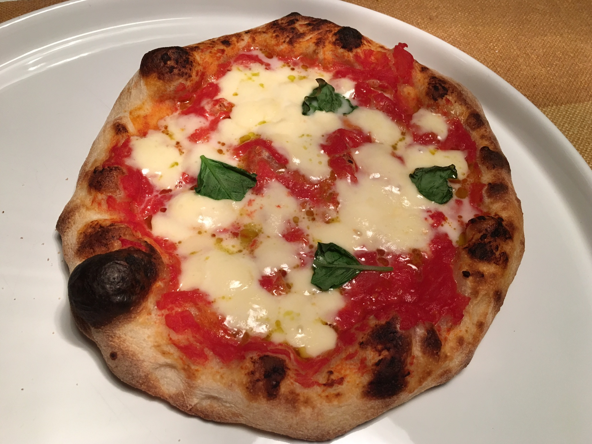

This is how I make pizza at home these days. I find this recipe to be a good compromise of timing and result. It involves preparing a pre-ferment (poolish) the day ahead but most of the preparation is done on the same day as when the pizza is going to be baked.

Tools you'll need:

- A pizza stone
- A pizza peel. I prefer wooden because the dough doesn't stick as much, but metal is fine too

Optional:

- A kneading machine (any kitchen robot with dough attachment will do)
- A dough scraper - makes it easier to handle the dough, which at this hydration is quite sticky

Ingredients for 4 pizzas:

For the poolish:

- 50 grams flour (use all-purpose flour with high protein content, at least 12g)
- 50 grams water
- A speck of yeast

For the dough:

- 503 grams flour (same as above)
- 326 grams water
- 10 grams salt
- 3 grams fresh yeast or 1 gram instant dry yeast

For the toppings (basic margherita):

- A can of peeled whole tomatoes (san marzano if you can find them)
- Three mozzarella balls
- Basil
- Olive oil

## Day 1

In the afternoon, mix flour, water and yeast for the poolish. Cover with plastic film and let rest overnight. The poolish should proof for at least 15 hours.

## Day 2

Check the poolish in the morning. If it didn't rise, order pizza from the closest restaurant.

Otherwise, start mixing the dough. Briefly mix the flour and most of the water together, and let stand for 15 minutes. Reserve some water for the yeast.

Dissolve the yeast in the remaining water. Mix with the rest of the dough, and add the poolish. Start kneading.

If kneading with the machine, set the speed to low and let it run for 12 minutes.

If kneading by hand, good luck. Keep a bowl of water nearby and wet your hands frequently so that the dough doesn't stick to your fingers. Use the dough scraper to fold the dough onto itself. Don't have a dough scraper? It sucks to be you. Things should get easier after a while, as the gluten develops and the dough becomes more elastic. Do this for 15 minutes.

Shape the dough into a ball, drizzle some oil into a container, spread the oil with kitchen paper, drop the dough in there and let it be, covered with a lid or plastic film, for about 6 hours.

The dough should be rising nicely. If it grows too much and/or starts making bubbles, punch it down, fold it a couple of times and let it be again. It should rise to about 3 times the original volume.

A couple of hours before baking, divide the dough in 4 balls and keep them covered.

Finally, baking time! Put the pizza stone in the oven (you don't have a pizza stone? Why are you here? OK you can use a baking tray instead, but honestly you are pushing it) and heat the oven to the max temperature for 30 minutes.

Prepare the toppings. Cut the mozzarellas in slices. Blend the tomatoes and their juice with a blender and put them in a colander to get rid of the water.

Take one of the dough balls. Push it down with your fingers while rotating it, stretch it, lift it up, move it around with your knuckles... dear lord it's hard to put this into words, just watch [this video](https://www.youtube.com/watch?v=9f9-xTcKzZo).

Sprinkle some flour (plus some semolina if you have it) on the peel, put the pizza disc there, spread some tomato sauce on it, throw it on the stone in the oven.

Let it cook for about 5 minutes (until the edge has risen nicely), take it out and spread the mozzarella (that you have hopefully previously sliced) on it plus some basil leaves, throw it back in the oven. Wait until the mozzarella is melted and the crust has a nice brown color, take it out, drizzle with olive oil, sprinkle some salt and voila! If you don't like it you have done something wrong.

