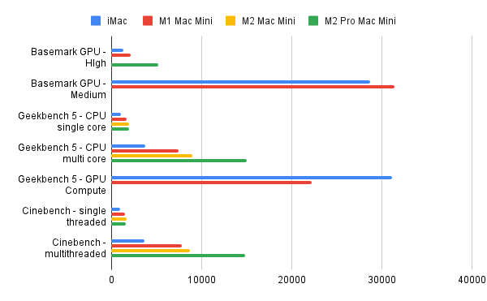
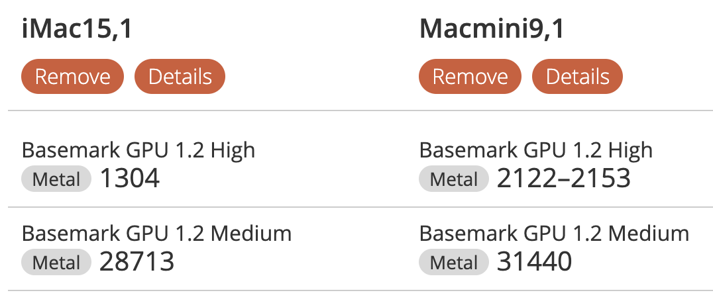
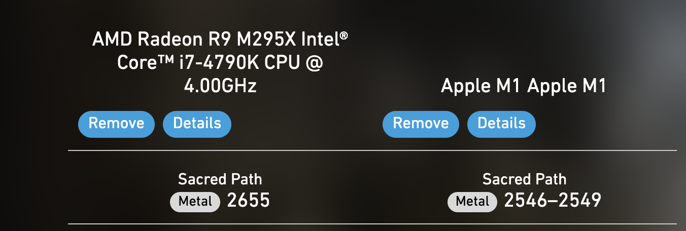
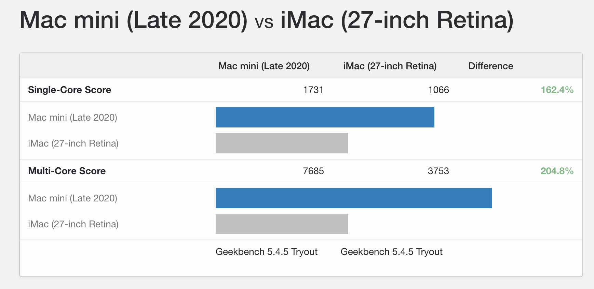

+++
title = "Benchmarking a 2014 iMac Retina against Mac Mini M1/M2"
date = "2023-02-13"
+++

## Introduction and results

After [I updated our 2014 iMac to Big Sur](@/posts/update-imac-mojave-bigsur/index.md), I wanted to know if it was time to upgrade to a newer Mac, especially the Mac mini with Apple Silicon. I ran a few benchmarks and collected the results in the chart below. 

The conclusion is that the Macmini M2 Pro would perhaps be worth the money, but the M1 or regular M2 not so much.

This was interesting also because until last year I worked for [a company that makes benchmarks](https://www.basemark.com/) (among other things), so I was curious to see how they compare to the competition. What follows describes my experience.

*(first written on Nov 24th 2022 and then updated to include the M2 Mini that was released recently)*

## BasemarkGPU and Basemark GPU Score

Given my background, the first thing I did was to try Basemark GPU and GPU Score (the latter developed under my watch!). I'm ashamed to say that although I tested Basemark's benchmarks many times, this was the first time I tried them as a user with a specific goal in mind. Clearly I should have done it much sooner.

Installing and running both Basemark GPU and GPU Score was pretty smooth. The visual quality of GPU Score's mid-tier workload, "Sacred Path", looked underwhelming compared to the 4 years older Basemark GPU. To be fair, the main selling point of GPU Score is ray tracing and the ray-traced benchmark [looks much better](https://www.youtube.com/watch?v=4BT_jAIu1wI).

Figuring out how to compare the results with a M1 Mac Mini wasn't as easy. In Powerboard 3 (the results database for Basemark GPU) filtering by system required to know that the system is recorded as "Macmini", whereas in Powerboard 4 it didn't work at all because systems are identified by their CPU (again, something I should have figured out and fixed while I was there), so you are left guessing which Apple system you are comparing.

Here are the results I got on Basemark GPU and Sacred Path, compared with an M1 macmini (I could not find results for the M2 except one that is in the summary chart and I cannot find anymore).

[System Benchmark Results | Basemark Power Board](https://powerboard.basemark.com/benchmark-result/1195734)

BasemarkGPU comparison: [https://powerboard.basemark.com/systems-compare/611643-365766](https://powerboard.basemark.com/systems-compare/611643-365766)

[Powerboard 4.0 | Compare performances of smartphones, tablets and PCs](https://powerboard4.basemark.com/benchmark-result/16192)

Sacred path comparison: [https://powerboard4.basemark.com/systems-compare/12755-10505](https://powerboard4.basemark.com/systems-compare/12755-10505)

It looks like in high-end graphics the Mac Mini wins, but in medium graphics the iMac wins or has similar performance.

Next, I tried some other benchmarks that I had heard about while I was at Basemark but, again, had never tried.

## Geekbench

The Geekbench 5 benchmark suite includes a CPU benchmark and a GPU compute benchmark. There is no graphics benchmark, which makes the test look pretty boring, but on the upside browsing and comparing the results database is a very nice experience.

CPU Benchmark:

[iMac (27-inch Retina) - Geekbench Browser](https://browser.geekbench.com/v5/cpu/18840173)

Compared to M1 Mac Mini:

[Mac mini (Late 2020) vs iMac (27-inch Retina) - Geekbench Browser](https://browser.geekbench.com/v5/cpu/compare/18834179?baseline=18840173)

Clearly the Mac Mini is the winner when it comes to CPU performance. GPGPU compute wasn't the same:

GPU Compute benchmark:

[Mac mini (Late 2020) vs iMac (27-inch Retina) - Geekbench Browser](https://browser.geekbench.com/v5/compute/compare/5942832?baseline=5944435)

I'm not sure what to make of this, because I thought the M1's GPU was undisputably superior. Perhaps it's not optimized for GPGPU. I couldn't find Geekbench Compute results for the M2.

The CPU results about the M1 and M2 Mac Minis are at these links:

- [Mac Mini M1](https://browser.geekbench.com/v5/cpu/19960328)
- [Mac Mini M2](https://browser.geekbench.com/v5/cpu/19960328)
- [Mac Mini M2 Pro](https://www.macrumors.com/2023/01/19/mac-mini-m2-pro-geekbench-scores/)

## GFXBench

GFXBench was often quoted as a competitor for GPU Score, especially its "Manhattan" workload. However I wasn't able to run it: it got stuck at "collecting device information". Sad.

## 3D Mark

3D Mark is the grandfather of GPU benchmarks and shares a common history with Basemark. It was the first graphics benchmark I ever run, and I still have fond recollections of the "Lobby Scene" from back in 2000. Unfortunately only Apple Silicon Macs are supported (by running the iPhone version in MacOS, something I didn't know you could do and found pretty cool) so I couldn't use it in this comparison.

## Unigine

Another benchmark I had heard about while at Basemark. Unigine is a 3D engine and the benchmark is built on it, similarly to GPU Score and the Rocksolid engine. The most recent workloads don't support MacOS so I ran the Valley workload from 2013. It ran fine, with music even, but it didn't give me a score at the end and I didn't know how to compare my run with anybody else's. Not useful.

## Novabench

I found Novabench while Googling for benchmarks. The user interface looked promising and it ran without issues. However it was impossible to compare my results with any other system in the database, so unless I get someone to run it on Macmini and share the results, this is not very useful. 

[Novabench results](https://novabench.com/result/bc80873e-aa05-4311-a870-aec6841ccaba)

## Cinebench

Cinebench is often quoted in hardware tests, so it wasn't hard to find reference results to compare with my own. It renders a 3D scene in single and multithreaded configurations, and emulates a 3D content creation application.

There is no database where to post my results, the reference values are from the links below:

- [Mac Mini M1](https://www.anandtech.com/show/16252/mac-mini-apple-m1-tested/2)
- [Mac Mini M2](https://www.check-mac.com/en/benchmark-cinebench_r23-10)
- [Mac Mini M2 Pro](https://e.infogram.com/3b7bfd20-a165-490f-a9d9-006fc2df351d?src=embed)

## Conclusions

The M2 Pro Mac Mini would be a sensible upgrade performance-wise, but the 32GB configuration, which I would want, costs 2000 EUR, still needs a display and has 512Gb of disk space compared to the iMac's 3Tb. It makes more sense to wait for a M2-based iMac retina if such a thing will ever arrive. Besides, there really isn't anything wrong with the iMac, the only time I noticed any slowness was when running the iOS simulator which takes ages to start up.

There are not that many 3D graphics benchmarks for Mac, BasemarkGPU being one of the few and the best one as far as I can tell. On the other hand I never used the iMac for gaming, so this was more a curiosity than a real use case.

On a different note, I am disappointed of myself for not doing this exercise while I was in charge of the product development at a company that makes benchmarks. Being hands-on is one of my values and I didn't follow it here. In my defense, Basemark makes many more things and my focus while I was there was more on automotive software development. 

P.S.: just as I finished writing this, The Guardian published a [5-star review of the M2 Mini](https://www.theguardian.com/technology/2023/feb/13/apple-mac-mini-m2-review-cheaper-tiny-but-mighty-computer) :O
