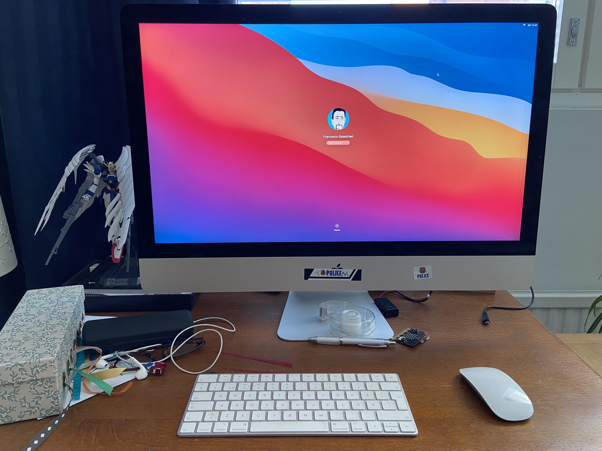

After many failed attempts, I finally managed to update our 2014 27" iMac retina from Mojave to Big Sur. Finding the right information was not easy,  so I thought it would be good to write it down in case it ever happens again.

The main reason the previous updates failed is that they stopped at the error `Storage system verify or repair failed 69716`, which showed up during the installation of BigSur. It doesn't seem to be a common error, but it is mentioned in this Apple Forum post:

[Storage system verify or repair failed 69… - Apple Community](https://discussions.apple.com/thread/253595285?utm_source=pocket_saves)

Since all of the potential solutions involve repairing or even formatting the disk, not to mention the possibility of the disk failing at any point in time, the first thing I did was to buy an external SSD drive and make a backup with Time Machine (which shamefully enough, I had never done until this point).

As many posts, including the one above, recommend, I first tried the "Repair" option in Disk Utility (from normal login, in "recovery mode" and in "single user mode"), but no issue was found. I then tried to erase the disk (also from Disk Utility), reinstall from the Time Machine backup and update - but the same error showed up.

Finally, as suggested in one of the replies to the post, I recreated the fusion drive by going in recovery mode, launching terminal and then giving the command `diskutil resetFusion`. For good measure I tried a clean install of Mojave from the recovery disk, and then updated to BigSur - this time it worked. This wasn't a very useful step but at least demonstrated that the update *could* succeed and that there wasn't anything too wrong with the disk. At this point (I probably should have done it in the first place) I restored once more from time machine, launched the OS update and finally was successful.

Everything seemed to work fine, except that Time Machine couldn't start a backup complaining that the "Macintosh HD Data" volume appeared twice and had to be renamed. It turns out that this volume didn't exist in Mojave but was introduced with... Catalina? and is used to store user data. I don't know why Time Machine thought there were two, but I renamed it "Macintosh HD Data 2" and Time machine was happy again - except that it couldn't do an incremental backup and had to do a new one.

The shell also changed from bash to zsh, but in the settings inherited from the previous OS the default was still the old bash. The default can be changed with the command:

```bash
chsh -s /bin/zsh
```

The update didn't fix one long-standing problem I had when connecting iOS devices via USB: the device keep disconnecting and reconnecting and no data transfer was possible. This can be fixed by restarting the USB daemon:
```bash
sudo killall -STOP -c usbd
```

Despite all these annoyances, it's a credit to Apple that the iMac is now very responsive and generally still works very well. Makes you wonder why you should buy a new computer. 


