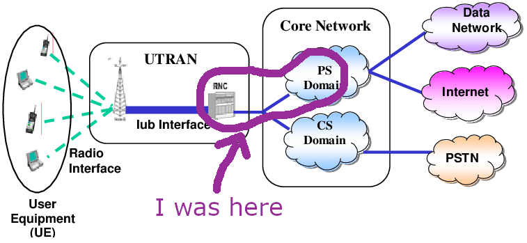

UMTS (Universal Mobile Telecommunications System) is a third-generation (3G) mobile communication network standard that provides high-speed data, voice, and multimedia services. Nokia had been very successful with its 2/2.5G GSM and GPRS circuit switching platform "DX200", and in 2000 it was getting ready to repeat the same succes with its next generation "IPA2800". 

Among the many network elements of a UMTS network is the Radio Network Controller (RNC), which connects the base stations, and therefore the users, to the core network, where all the switching magic that takes one packet from one end of the world to the other happens.



UMTS came at a strange time in the history of telecommunications and technology in general. It was the peak of the dot-com bubble, and the mobile internet was rightfully seen as the next Big Thing. Governments became greedy and sold the licenses for the UMTS frequency spectrum at insanely high prices. This, and the dot-com bust, wiped away the profits of many companies, mainly mobile operators and network equipment manufacturers.

Eventually 3G became mainstream, and the evolution to 3.5G, 4G and 5G that followed was much more uneventful. 

## What I did

I started at Nokia Network's Packet Switching department in January 2000 with the title of "R&D Engineer". I was fascinated by computer networks at the time, and especially mobile communications and mobile phones, and Nokia was the biggest name around. My master's thesis had been about Connection Admission Control, one of the features of the Radio Network Controller, and this job looked like the perfect continuation of my studies.

My first task was to write tests for one of the software components in the DX200 system, the purpose of which is now lost to me. Software for Nokia's switching elements was written using a high-level language called [TNSDL](https://en.wikipedia.org/wiki/TNSDL), developed in-house. TNSDL was basically a compilable state-machine description language. Here is what it looked like:

```
STATE idle COMMENT 'Idle state';
  INPUT are_you_busy;
    OUTPUT no TO SENDER;
    NEXTSTATE -; /* No state change */
  /* ... other input handlers */
ENDSTATE idle;

STATE *(idle) COMMENT 'Any state, except idle';
  INPUT are_you_busy;
    OUTPUT yes TO SENDER;
    NEXTSTATE -; /* No state change */
ENDSTATE *(idle);

STATE * COMMENT 'Any state';
  INPUT are_you_alive;
    OUTPUT yes TO SENDER;
    NEXTSTATE -; /* No state change */
ENDSTATE *;
```

Later I became an official Nokia Trainer and gave courses about TNSDL, which gave me the chance to visit Hangzhou (China). But before that, I moved to the next generation IPA 2800, parts of which were based on a Posix RTOS by Sun Microsystems called [ChorusOS](https://en.wikipedia.org/wiki/ChorusOS). One of the most exciting things I did was developing Nokia's first device driver to run on ChorusOS. "My" driver's responsibility was handling a switching processor by [Agere Systems](https://en.wikipedia.org/wiki/Agere_Systems), an American company later bought by Lucent. 

I don't know how much of my code was preserved after I left, but I like to think that for a while my software was somehow involved in getting 3G calls through.

## What I learned

This being my first job in a large corporation, and the first time I lived abroad on my own, I learned a lot. I learned how to work in a team, how to communicate with people from different cultures, and how to work in a large project.

Technically however I can't say that I learned much, which is why after two years I left. The code itself was not very complex, and the practices rather old-fashioned, although at the time I didn't know any better. Just to give an example, if I missed an integration deadline I had to make a phonecall (!) to the release manager to get my component integrated.

## Notes

* the name "IPA2800" apparently came from "IP" for IP networking, "200" for DX200 and "8" because for the Chinese lucky number. No idea what the "A" stood for.
* I found the datasheet for the APC processor [here](http://datasheet.elcodis.com/pdf/50/60/506010/tapc640l34-bllk3e-db.pdf)


