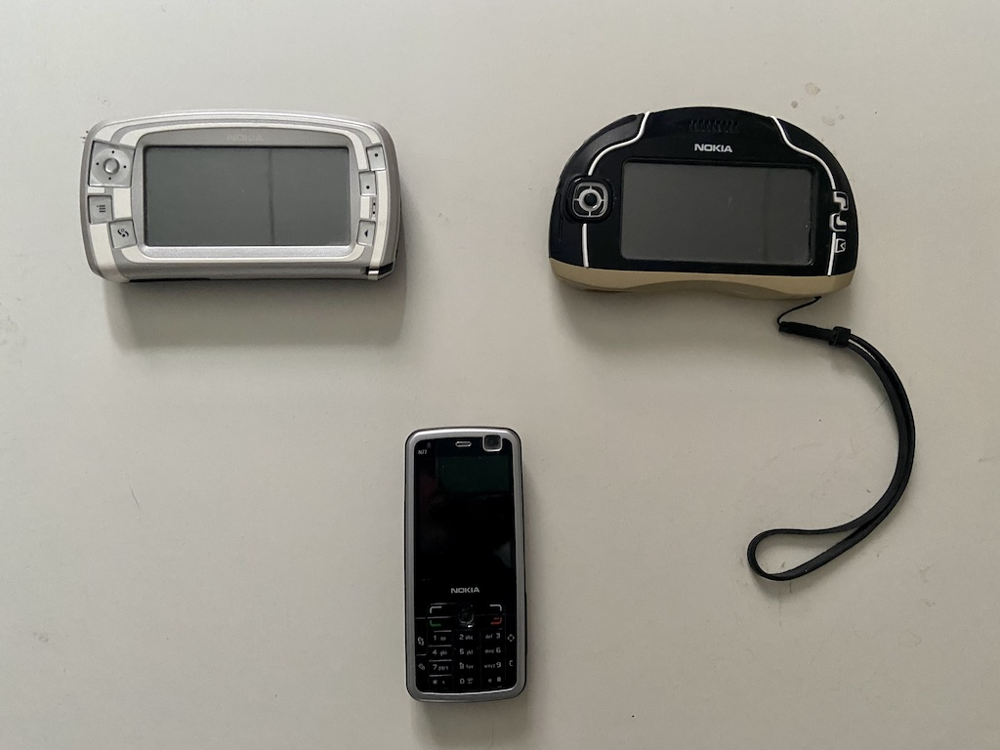
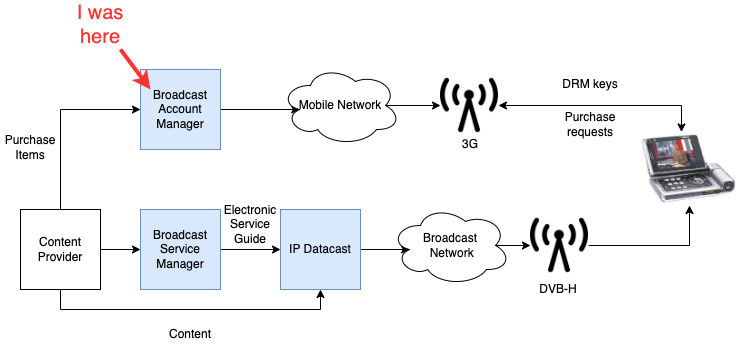

In the early 2000s, during the rise of digital video and before the advent of streaming, broadcasters and mobile operators were looking for ways to bring TV to mobile phones. One such way was [DVB-H](https://en.wikipedia.org/wiki/DVB-H), a technology that used the same radio spectrum as DVB-T, the digital terrestrial TV standard, to broadcast TV channels to mobile phones.

There was a small team working on this at Nokia, called "IPDC" (IP Datacast). It was hosted within the Nokia Ventures Organization incubator and later, when the technology became more mature, moved to the Nokia Multimedia division. At this point Nokia Mobile Phones and Nokia Networks had split in two separate companies, and unlike the PoC project where I had worked before, the server side of the Mobile TV project was also developed by Nokia Mobile Phones.

The first device to receive DVB-H broadcasts was the Nokia 770 Internet Tablet, which was released in 2005, followed by the 7710. Both of them were experimental models and never went on sale. The first phone to receive DVB-H broadcasts was the Nokia N92, codenamed "Magnum", released in 2006, quickly followed by the cheaper N77 and a few more. Below is my collection of DVB-H phones: N770, N7710 and N77. I had an N92 as well but I can't find it anymore (which is a pity because I just saw it going for 1300 EUR on eBay!).

Standardization was taking place both in the Open Mobile Alliance (OMA) and DVB Forum organizations, which complicated things quite a bit. Nokia was active in both standards and was committed to avoiding fragmentation, but other companies were favoring either side. One of the biggest fights was about Digital Rights Management. Basically whoever distributed the DRM keys would own the customer, and brodcasters, mobile operators and handset manufacturers all wanted to be in that role. The conclusion was to have different DRM profiles, smartcard-based and handset-based, with variations for DVB and OMA. As they say, the good thing about standards is that there are so many to choose from.

In Europe the service was launched in limited areas by major operators during hte 2006 football world cup, and continued to roll out in different countries until it was shut down pretty much everywhere by 2012, replaced by the much more convenient video streaming that didn't require any specialized radio technology.

## What I did

I was the project manager for the "Broadcast Account Manager" (BAM), the server in charge of managing channel subscriptions and distributing digital rights to users' phones. The development of the BAM was fully outsourced to Wipro in Hyderabad, where I traveled several times. In the beginning I was also acting as a systems architect and writing specifications and architecture documents, and in this role I attended several standardization meetings in the OMA Mobile Broadcast and DVD groups, and authored or co-authored a few patent applications:

https://patents.google.com/patent/US8448207B2/
https://patents.justia.com/patent/8332327
https://patents.google.com/patent/WO2008053322A2/

I also supported the sales team in technical pre-sales discussions and answering RFPs and RFQs. One highlight was the work with the "German consortium", a coalition of T-Mobile, Vodafone and O2 that was bidding for the DVB-H license in Germany. We were offering a joint solution with Nokia Networks (which by this time had become Nokia Siemens) and after many months of negotiations we won the contract. Sadly the German Consortium wasn't awarded the license and the project was cancelled, but I'm still very proud of the result.

## What I learned

This was my first project management job and I enjoyed it a lot. I did have a nagging feeling that I was leaving coding behind, but it got drowned by the excitement of finally being able to call the shots and "see the big picture", not to mention having a more varied working day and a good amount of traveling. It helped that the team was small and mostly free from interference from the rest of the company, and that I had excellent managers, probably the best I've had in my career.

I had my first exposure to Agile when, out of curiosity, I went to a Certified Scrum Master course held by Jeff Sutherland, one of the fathers of Scrum. I never really managed to apply the practices to my work during my time in the Mobile TV team, but I was deeply affected by the Agile Manifesto and the concepts explained in the course. "The true measure of progress is working software" has been one of my mantras ever since.

I definitely stepped out of my comfort zone with the standardization work. Within the year or so that I participated in the OMA activities, I grew from a shy listener with impostor syndrome, to a confident delegate capable of creating and challenging new parts of the standard. The high point was a joint Change Request with Qualcomm, which was tought impossible since Qualcomm was Nokia's arch-enemy in that group (they had a competing technology called MediaFlo).

I often reflect on this time as the point in my career where I left coding behind, which I later regretted. Was it worth it? At the time, definitely. I enjoyed every minute of my time in the Mobile TV team and gained experiences I would never have had as a software engineer, at least not at Nokia. I also discovered that I truly enjoy helping people work well together. Perhaps I should have realized that going back to a technical role after that wouldn't have been such a step back career-wise, but that's what it felt like and that's why I didn't really consider it (although I did interview with Google for a software engineer position, the first of many times that I was rejected by the big G :D).