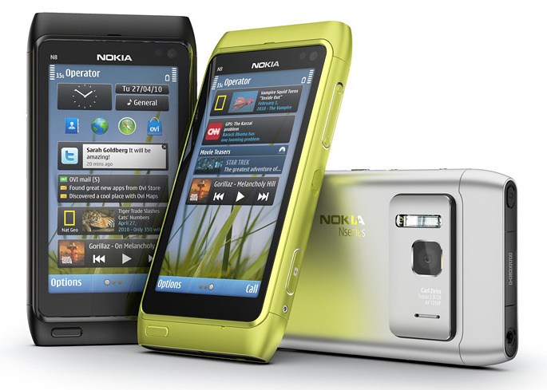
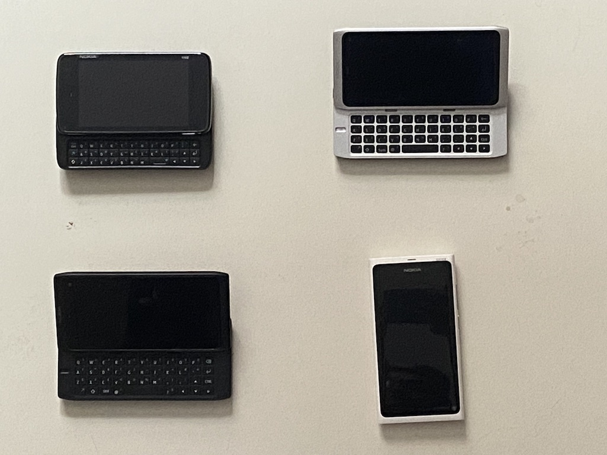

The release of the iPhone in 2007 marked a turning point for Nokia, which had held the title of the world's top phone manufacturer since 1998. The iPhone's groundbreaking design and features left an indelible mark on the industry. In response, Nokia hastened the development of its Linux smartphone, a project that had been in progress for some time within the Open Source Software Operations (OSSO) division and that would become the Nokia N9 and its accompanying Meego platform.

The story of Meego is long and complex, and many articles have been written about it, including this [pretty accurate account](https://www.maquinasvirtuales.eu/the-story-of-nokia-meggo/). I don't see any point in repeating all that, so I'll limit myself to the highlights that I have witnessed personally.

Up to the point when I joined in 2008, the OSSO division had been a small group of people working on Linux-based mini-tablets (actually smaller than many of today's phones). The Maemo platform that powered them was basically a Linux distribution with a few customizations and a few Nokia-specific apps. The first Nokia tablet, the N800, had been released in 2006, and the N810 had followed in 2008. Development of a tablet with cellular capabilities, what would become the Nokia N900, was in progress, but it was considered too niche. The real "iPhone killer" would be the next product, a smartphone for the mass market based on a totally new platform developed by mostly totally new people, one of which was me.

In hindsight, it was a mistake to develop the two platforms in parallel, and the development of the N900, which was inevitably delayed, held up experienced resources that could have been much more useful working on the new platform. But we were told that the N900 needed to succeed quickly to prove that Nokia could make a Linux phone.

2008 was also the year when Nokia had purchased Trolltech and its Qt framework, which was going to be the development platform for all of its smartphones. This was another difference between the N900, which used GTK, and the next product. The decision to go with Qt had pissed off many experienced GTK developers, who left the company shortly before I joined.

Another funny story was the browser. Nokia's Symbian browser was based on the open source WebKit engine, and so was Qt's Webview and the Web runtime that Nokia was developing as yet another way to attract third-party developers. Apple's browser was based on WebKit too, and Nokia even hired some of WebKit's most experienced contributors. However, the Maemo browser had been based on Mozilla's Gecko engine since the beginnig, and the browser team wasn't willing to let go of it. In fact in Meego they took it a step further and made a deal with Mozilla to have Firefox Mobile as the default browser. This meant that Mozilla was in charge of the UI, that looked out of place and was made with Mozilla's XUL engine rather than the same UI components used by the rest of the applications. As one senior designer who later joined the project put it when asked about the browser's UI, "All we can do is send fanmail to Mozilla". Eventually a new webkit browser was developed by a different team and became the default browser in the N9, which was the right call but made far too late.   

The first target of the new Meego platform was a device codenamed Columbus, which was scrapped after yet another delay of the software, although its industrial design lived on in the Nokia N8 (picture below). It was followed by the N950, codenamed Dali, a tablet with a slide-out keyboard. This too was canceled on account of not having mass-market appeal.

While the hardware was evolving, so was the software, and most importantly the UI. The initial concept for the Harmattan UI was a scrollable page with widgets of all kinds, and no traditional applications. It was horrible, complex just for the sake of being different and yet touted as revolutionary. I remember showing it in a meeting to a VP newly hired from Apple and while he was politely positive during the presentation, a few days after he announced a drastic change in direction to a more traditional UI.

Finally things clicked on both the hardware and software, with the beautifully simple, button-less N9 (codename "Lankku" - plank) on one side, and the introduction of the "swipe" gesture on the other. The Swipe was a stroke of genius and made gesture-based multitasking on a smartphone simple and intuitive for the first time, without the need for a home button. See it in action in the video below:  

[Swipe demo](https://www.youtube.com/watch?v=ymQSoM6FgYs#embed)

Right when Meego was finally going somewhere with the N9, Nokia hired a new CEO, Stephen Elop, who decided that Nokia couldn't afford in-house development of a mobile OS and that it should instead adopt Microsoft's Windows Phone on all of its smartphones, killing both Symbian and Meego in a single swoop.

Still, the N9 was almost ready by the time this decision was made, and it was easier for Nokia to finish it and release it than canceling the deals already made with suppliers, distributors etc. Despite the obvious disappointment, this was the best time we had in the project: the platform was becoming mature, management stopped meddling and we had only one product to make, which made prioritization a lot easier.  

The [reviews](https://www.gsmarena.com/nokia_n9-review-659.php) were unanimously positive and lamented the fact that the product was a one-off, which was somewhat vindicating. More vindication came later when the Windows Phone strategy didn't pan out, and today Nokia is an also-ran making nondescript Android phones. Meanwhile, many of the features of the N9, including the "swipe" gesture,  appeared in iOS and Android many years later.

Here is a picture of the Maeme and Meego devices I collected during my time at Nokia. None of them boot up anymore.

## What I did

My first job in Meego was "Technical Product Owner" for the address book. It was still early days and aside from a UI designer and a product manager there was no team, so the first thing I had to do was quickly contracting two developers from a local subcontracting company and get them to start prototyping some wild ideas (one of them, called the "soup" had people's faces drifiting on the screen as croutons in a soup, although the team thought it looked more like they were being flushed down a toilet).

Later the team grew and got into more focused development, but I was promoted to manage the full portfolio of built-in applications, about 13 teams and 150 people in total counting designers and testers as well. Until we hit feature complete my job was to lead the planning activities and report the progress to management. Later, as the focus shifted to bug fixing, I was tracking and prioritizing hundreds of bugs. I also made it a point to test every daily build. The CI infrastructure was impressive and better than anything I have seen since.   

As if building a new mobile OS with a new UI paradigm wasn't enough, one of the goals of the project was to transition the organization to agile development. I participated in process development and the application of scrum "at scale", piloting concepts that would later become part of the SaFE certification, such as release trains and product iterations. 

After the phone was launched and I was waiting to be shown the door, I created a couple of application using the Qt framework (which was Meego's development environment) and made a few hundred euros selling them on the application store :)

## What I learned

I could talk for hours about the things I learned while in the Meego project, but here are the most important ones:
- Project management is 20% planning and 80% following up. Many projects fail because people just assume that their plans will be followed.
- Opinions kill projects, or at least slow them down. When I first joined Meego I was in awe of all the smart people working there who had opinions about pretty much anything in the project. In reality these opinions were useless and even damaging, because they distracted people from the real discussion. The only opinions that matter are those of the people who were actually doing the work.
- Beware of consultants and external quality departments. The people doing the work should always be involved in the choice of their tools and processes. After choosing a scrum tool that everyone hated, the quality manager said in a meeting that "people will always be unhappy about the tools, so I can choose what I think is best". This is one of the most idiotic things I've ever heard.
- Towards the end of the project we were managing thousands of bugs and figuring out which ones to prioritize was almost a data science problem. We used flags, charts, trends, daily triage meetings, automated crash reports and daily dog fooding to tame that matass of bugs.
- I studied the Qt framework and really liked it. Especially QML was (is?) a great language for declarative UI programming and iOS and Android are catching up only now with SwiftUI and Jetpack Compose.