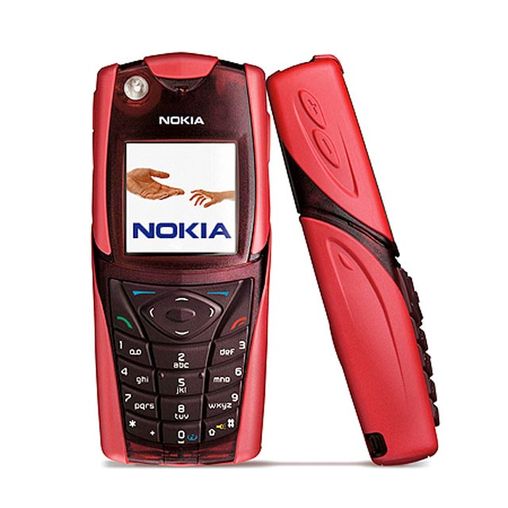

Push-to-talk over Cellular, or PoC as it was commonly known, was a Voice-over-IP service that replicated the functionality of two-way radio communication (in other words walkie-talkies) on regular, internet-enabled mobile phones. It was developed by Nokia's Professional Mobile Radio (PMR) division as an evolution of its [TETRA]((https://en.wikipedia.org/wiki/Professional_mobile_radio)) technology, and meant for both professionals and consumers. A use case often taken as an example was "a group of friends skiing together and keeping in touch via one-to-many group communication".

Today you would just run the service on some kind of public internet server, but in the early 2000s, when the project started, mobile IP connectivity was very limited and VoIP was only feasible with dedicated servers installed in a mobile operator's network, which is what Nokia was planning to sell. The underlying platform was a carrier-grade version of Linux called Montavista and Nokia's [FlexiServer]((https://www.globenewswire.com/news-release/2002/02/20/1845763/0/en/Nokia-unveils-uniform-platform-technology-for-All-IP-mobility-networks.html)) platform which was a more modern version of the IPA2800 and DX200 platforms I had worked on previously.

Other companies were working on similar products, and interoperability was to be provided by a new [standard defined by the Open Mobile Alliance](http://www.openmobilealliance.org/release/PoC/V2_0-20110802-A/OMA-AD-PoC-V2_0-20110802-A.pdf). Even Nokia's fully proprietary first version of the product was based on standard protocols like [SIP](https://en.wikipedia.org/wiki/Session_Initiation_Protocol) for client-server communication, and the more obscure [Megaco](https://datatracker.ietf.org/doc/html/rfc3015). 

This being Nokia, there couldn't be a network feature without a corresponding mobile phone. The first target was a rugged phone codenamed Debra and released to the market as the Nokia 5140. Sadly I don't have that phone anymore, but here is how it looked like: 

A few more phones after that had the feature, but the service didn't last long as VoIP applications like Skype were becoming popular. The PoC team was later repurposed to work on other mobile internet serivces, and the product was eventually discontinued in 2007.

## What I did

I joined the PoC Control Plane team in 2002 as a software engineer. The control plane was a server written in C++ which took care of session management and my first task was to implement the "In memory database" (cheekly shortened IMDB, like the internet movie database), a component that managed the sessions' data. Later I moved on to implement the server logic to create sessions, users, groups etc. 

One of the things I am most proud of was solving a performance bottleneck that was caused by one of the third party components that we used (actually developed by another team at Nokia), the implementation of the SIP protocol. The library had a reference-counted custom string class protected by a single mutex that was creating a lot of contentions in our multi-threaded application. The fix was easy, but to find out what the problem was I had to highjack and instrument the pthread library to pinpoint the offending mutex, which for me was some next level stuff. I also implemented a rudimentary automated test suite that while flaky caught many bugs and made me discover the power of test automation.

## What I learned

This was the high point of my career as a software developer. I learned about Linux, C++, the C++ standard library, design patterns. I read many books and magazines, and one of my fondest memories is reading "The Craftsman", a series of articles by Robert C. Martin on the now defunct Dr Dobb's Journal. Towards the end I discovered "The Pragmatic Programmer" and if I had read it sooner I may have stuck with a coder's career for longer.

I left because I felt the urge to advance in my career and take the lead on something, which didn't look like it was going to happen in PoC, although I may have been a little too impatient. Despite all the talks of dual ladders, unless you were some kind of genius (and I definitely am not) it was very rare to advance in a technical role as far and as fast as you would in management, at least in a European megacorp such as Nokia. Things started to change around that time, and the group started to value software engineers more, for example creating the new "Lead Developer" role which would have been the perfect fit for me, I think. 

Among other things, I learned the term "Code Monkey" while I was in the PoC team. And in a funny coincidence, my farewell present were a pair of cheap walkie talkies that were chosen to represent PoC, but also had the keys CODE MON KEY. Joke, coincidence or the last words from a fate left behind?