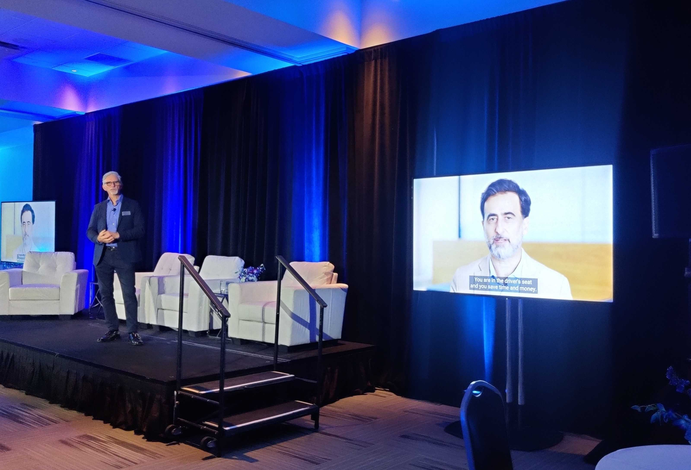

[Basemark](https://www.basemark.com) is a Finnish startup with a background in graphics benchmarks that pivoted to automotive software development a few years ago. Basemark's specialties are hardware accelerated graphics and machine learning, and they have a long history of working with automotive companies. Among Basemark's products are the [Basemark GPU](https://www.basemark.com/benchmarks/basemark-gpu/) and [GPUScore](https://www.basemark.com/benchmarks/gpuscore/) graphics benchmarks, the [Basemark Automotive Test Suite (BATS)](https://www.basemark.com/bats/) and the [Rocksolid Graphics Engine](https://www.basemark.com/rocksolid-graphics/).

In September 2021, Basemark launched a new automotive product called "Rocksolid Core", a complete platform for software defined vehicles. This was the launch video (spot a familiar face!):

[Rocksolid Core launch video](https://www.youtube.com/watch?v=fhv4RD-NU2o#embed)

Software Defined Vehicles (SDV) are a big trend in the automotive industry. Traditionally, the electronic system of a car is made by hundreds of different, interconnected electronic components, each with their own software stack and their own hardware interface. This makes it very hard to update the software after the car is sold, and it also makes it hard to reuse the same software in other cars. The idea behind SDV is to have a single computer unit that controls all the car's functions, and to have a single software stack that runs on that unit. This approach was first adopted successfully by Tesla and other car manufacturers wanted to replicate it, but they were bogged down by their lack of knowledge in this field and their existing tools and practices. The idea behind Rocksolid Core was to provide a ready-to-use platform for SDV that could run on multiple hardwares.

Rocksolid Core was first demonstrated at CES 2022 in a table-top setup. The following video shows a recap of Basemark's CES 2022 demos:

[Rocksolid Core CES 2022 demo](https://www.youtube.com/watch?v=h57mM3UYIiw#embed)

Later, Basemark equipped its demo car with a Rocksolid Core system and took it on a "road show" through Europe, starting with [Vehicle Elecctronics and Connected Services (VECS)](https://insightevents.se/vehicle-electronics-connected-services/) conference in Sweden and following with a visit to all major car manufacturers in central Europe. [This video](https://www.linkedin.com/posts/basemarkltd_basemarklane-keep-assist-drive-activity-7010902412383121408-s5eM?utm_source=li_share&utm_content=feedcontent&utm_medium=g_dt_web&utm_campaign=copy) shows Rocksolid Core's assisted driving capabilities in action.

Rocksolid Core continues to be developed today, although with more focus on augmented reality for automotive use cases.

## What I did

I joined Basemark in December 2020 as a project manager, but due to some changes in the company I ended up becoming the Head of Products after less than two months. The company didn't have a separate product management function, and as head of products I was responsible for both the product roadmap and its implementation. My responsibilites included all of Basemark's products, including the benchmarks and Rockoslid Graphics, but my main focus was on Rocksolid Core that I was involved with since the very beginning.

To succeed with Rocksolid Core, Basemark needed to grow fast and acquire new skills in automotive software development and functional safety. In the first half of 2021 I spent a great deal of my time interviewing and hiring people, and I'm very proud of the team we built. I am also proud of the fact that we were able to attract some high-caliber people from much larger companies, which was not easy to do for a small company like Basemark. It was a very hectic time as we doubled the size of the products organization in just a few months.

In the second half of 2021 I spent most of my time working with the team to get the product ready for launch. This included a lot of work on the software, including the development of a new machine learning framework and being able to control the car without any support from the manufacturer. I reported the progress regularly to the board of directors.

Getting the CES demonstration ready required a lot of hard work and out-of-the box thinking, but thanks to some incredible people we made it. I didn't get to travel to CES myself, but at least I shared the stage virtually with Formula 1 champion Damon Hill! 

Pic or it didn't happen:

## What I learned

These were probably the most intense two years of my career, and I learned a lot in a relatively short time. 

The main reason I joined Basemark was because I wanted to have some experience working in a startup under my belt. I had been working in large companies for a long time, and I wanted to see how things are done in a smaller company. Reporting to the CEO, I got to see how a startup works from the inside, and I learned a lot about the challenges of growing a company. This was the first time I had to interact with a board of directors, and I found it very rewarding. I don't know how it is in other companies, but Basemark's board was a very supportive group of people who were always ready to help.

It was exhilarating to be able to decide what do, how to do it and with whom, and to be able to make decisions quickly. However this put a lot of responsibility on me, which kept me up at night especially in the beginning. But over time my confidence grew and even though I made many mistakes, I learned a lot and became a better leader.

I learned about automotive software development and the automotive industry, which is a very different beast from consumer software especially in terms of processes. I can't say that I found it too exciting, what with all the functional safety requirements and the long development cycles, but I learned a lot about the industry and I'm glad I got to see it from the inside.

I also learned a lot about product management. I had some experience in this area from my previous job, but I had never been in a position where I was responsible for the whole product. I learned a lot about the product development process, and I got to see how a product is developed from the very beginning to the point where it is ready for launch.

And of course I learned about hiring and firing, which is a very important part of a startup's life. I had to fire a few people, which was not easy, but I also hired a lot of people, and I'm very proud of the team we built.